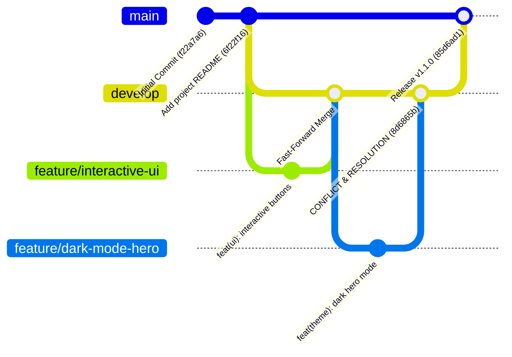

# DevOps Lab 1: Git Branching Strategies, Merges, Conflict Resolution & Pull Request Management

**Repository:** `https://github.com/Rehan038/DevOpsLab1.git`  
**Project:** `travel-india` Static Web Application  
**Author:** DevOps Engineering Team  
**Date:** September 2026  

---

## Table of Contents

1. [Executive Summary & Objectives](#1-executive-summary--objectives)
2. [Branching Strategies Architecture](#2-branching-strategies-architecture)
   - 2.1 [Git Flow vs. GitHub Flow vs. Trunk-Based](#21-git-flow-vs-github-flow-vs-trunk-based)
   - 2.2 [Branch Naming & Workflow Adopted](#22-branch-naming--workflow-adopted)
   - 2.3 [Visual Workflow Diagram](#23-visual-workflow-diagram)
3. [Step-by-Step Hands-On Execution](#3-step-by-step-hands-on-execution)
   - 3.1 [Step 1: Inspecting Base State](#31-step-1-inspecting-base-state)
   - 3.2 [Step 2: Creating Integration Branch (`develop`)](#32-step-2-creating-integration-branch-develop)
   - 3.3 [Step 3: Creating Feature 1 (`feature/interactive-ui`) & Fast-Forward Merge](#33-step-3-creating-feature-1-featureinteractive-ui--fast-forward-merge)
   - 3.4 [Step 4: Creating Feature 2 (`feature/dark-mode-hero`)](#34-step-4-creating-feature-2-featuredark-mode-hero)
4. [Simulating & Triggering the Merge Conflict](#4-simulating--triggering-the-merge-conflict)
   - 4.1 [The Conflicting Changes (Side-by-Side)](#41-the-conflicting-changes-side-by-side)
   - 4.2 [Executing the Merge & Triggering Conflict](#42-executing-the-merge--triggering-conflict)
   - 4.3 [Git Conflict Output & Unmerged State](#43-git-conflict-output--unmerged-state)
5. [Anatomy of Conflict Markers & Local Resolution](#5-anatomy-of-conflict-markers--local-resolution)
   - 5.1 [Understanding Git Conflict Markers](#51-understanding-git-conflict-markers)
   - 5.2 [Resolving Conflict in `index.html`](#52-resolving-conflict-in-indexhtml)
   - 5.3 [Resolving Conflict in `style.css`](#53-resolving-conflict-in-stylecss)
   - 5.4 [Staging, Verifying, and Finalizing the Merge Commit](#54-staging-verifying-and-finalizing-the-merge-commit)
6. [Release Management & Release Tagging](#6-release-management--release-tagging)
   - 6.1 [Merging `develop` into `main`](#61-merging-develop-into-main)
   - 6.2 [Creating an Annotated Release Tag (`v1.1.0`)](#62-creating-an-annotated-release-tag-v110)
   - 6.3 [Complete Commit Graph Analysis](#63-complete-commit-graph-analysis)
   - 6.4 [Remote Synchronization](#64-remote-synchronization)
7. [Pull Request (PR) Management Guide](#7-pull-request-pr-management-guide)
   - 7.1 [The Pull Request Lifecycle](#71-the-pull-request-lifecycle)
   - 7.2 [Standard PR Description Template](#72-standard-pr-description-template)
   - 7.3 [Configuring Branch Protection Rules](#73-configuring-branch-protection-rules)
   - 7.4 [Pull Request Merge Strategies](#74-pull-request-merge-strategies)
   - 7.5 [Handling PR Conflicts on GitHub vs Locally](#75-handling-pr-conflicts-on-github-vs-locally)
8. [DevOps Troubleshooting & Git Commands Cheat Sheet](#8-devops-troubleshooting--git-commands-cheat-sheet)

---

## 1. Executive Summary & Objectives

In modern DevOps and software engineering, branching strategies provide an isolated, controlled environment for collaborative development. They prevent unstable or incomplete code from destabilizing production, enable parallel feature velocity, and provide clear audit trails for deployments.

### Lab Objectives
1. **Branch Creation**: Create logical branches matching professional branching standards.
2. **Implement Branching Strategy**: Establish a Git Flow/GitHub Flow integration pattern (`main`, `develop`, and `feature/*` branches).
3. **Execute Merges**: Perform Fast-Forward merges and 3-way (recursive/ort) merges.
4. **Induce & Resolve Conflicts Locally**: Simulate concurrent developer collisions on identical file sections, inspect conflict markers (`<<<<<<<`, `=======`, `>>>>>>>`), resolve conflicts cleanly by harmonizing features, stage changes, and commit the resolution.
5. **Pull Request Management**: Document the end-to-end pull request lifecycle, code review best practices, branch protection, and merge methods.
6. **Documentation**: Provide a reproducible technical guide with exact command outputs and commit topology.

---

## 2. Branching Strategies Architecture

### 2.1 Git Flow vs. GitHub Flow vs. Trunk-Based

| Dimension | Git Flow | GitHub Flow | Trunk-Based Development |
| :--- | :--- | :--- | :--- |
| **Primary Branches** | `main` (production), `develop` (staging/integration) | Single `main` branch | Single `main` / `trunk` |
| **Supporting Branches** | `feature/*`, `release/*`, `hotfix/*` | Short-lived `feature/*` branches | Short-lived feature branches (< 1-2 days) |
| **Release Cadence** | Scheduled, milestone-based releases | Continuous Deployment (CD) upon PR merge | High-frequency continuous integration (CI) |
| **Conflict Frequency** | Moderate to high if branches stay open long | Low (branches merge rapidly) | Lowest (frequent sync & feature flags) |
| **Best Suited For** | Enterprise products, mobile apps, scheduled releases | Web applications, SaaS with automated testing | High-performing DevOps teams with mature CI/CD |

### 2.2 Branch Naming & Workflow Adopted

For this repository, we implemented a robust **Git Flow / GitHub Flow hybrid**:
- `main`: Production release branch. Contains only thoroughly tested, production-ready code. Direct commits are restricted.
- `develop`: Integration branch. Aggregates completed features before creating a production release.
- `feature/interactive-ui`: Feature branch adding enhanced call-to-action buttons and quick package navigation.
- `feature/dark-mode-hero`: Feature branch introducing night/day dark hero mode and theme toggle support.

### 2.3 Visual Workflow Diagram



---

## 3. Step-by-Step Hands-On Execution

### 3.1 Step 1: Inspecting Base State

The repository begins on the `main` branch with clean working tree.

```powershell
git status
git branch -a
git log --oneline -n 3
```

**Terminal Output:**
```text
On branch main
Your branch is up to date with 'origin/main'.
nothing to commit, working tree clean

* main
  remotes/origin/HEAD -> origin/main
  remotes/origin/main

6f22f16 Add project README
f22a7a6 Initial Commit
```

---

### 3.2 Step 2: Creating Integration Branch (`develop`)

Create and switch to the `develop` branch from `main`:

```powershell
git checkout -b develop
```

**Terminal Output:**
```text
Switched to a new branch 'develop'
```

---

### 3.3 Step 3: Creating Feature 1 (`feature/interactive-ui`) & Fast-Forward Merge

Create the first feature branch off `develop`:

```powershell
git checkout -b feature/interactive-ui
```

#### Code Modifications
In `travel-india/travel-india/index.html`, lines 20–27 were updated to replace the simple button with structured hero actions:
```html
<section class="hero">
    <h2>Discover Incredible India</h2>
    <p>Experience culture, heritage, vibrant traditions and breathtaking nature.</p>

    <div class="hero-actions">
        <button class="btn-primary" onclick="showMessage()">Explore Featured Tours</button>
        <button class="btn-secondary" onclick="alert('Viewing popular packages!')">View Packages</button>
    </div>
</section>
```

In `travel-india/travel-india/css/style.css`, styles for `.hero-actions`, `.btn-primary`, and `.btn-secondary` were added.

#### Commit & Fast-Forward Merge
```powershell
git add travel-india/travel-india/index.html travel-india/travel-india/css/style.css
git commit -m "feat(ui): add interactive hero action buttons and quick navigation"

# Return to develop and merge
git checkout develop
git merge feature/interactive-ui
```

**Terminal Output:**
```text
[feature/interactive-ui 58169e6] feat(ui): add interactive hero action buttons and quick navigation
 2 files changed, 27 insertions(+), 4 deletions(-)

Switched to branch 'develop'
Updating 6f22f16..58169e6
Fast-forward
 travel-india/travel-india/css/style.css | 22 ++++++++++++++++++++++
 travel-india/travel-india/index.html    |  9 +++++----
 2 files changed, 27 insertions(+), 4 deletions(-)
```

> **DevOps Concept — Fast-Forward Merge:**  
> Because `develop` had no new commits since `feature/interactive-ui` branched off, Git simply moved the `develop` HEAD pointer forward to `58169e6` without creating an extra merge commit.

---

### 3.4 Step 4: Creating Feature 2 (`feature/dark-mode-hero`)

To simulate concurrent development where two engineers work simultaneously from the same baseline (`6f22f16`), we branched `feature/dark-mode-hero` from the base commit prior to Feature 1's merge:

```powershell
git checkout -b feature/dark-mode-hero 6f22f16
```

#### Code Modifications on Feature 2
In `travel-india/travel-india/index.html`, lines 20–27 were independently modified to introduce night exploration and dark mode toggle:
```html
<section class="hero dark-hero">
    <h2>Explore India by Night & Day</h2>
    <p>Immerse yourself in moonlight monuments, night markets, and golden sunsets.</p>

    <button class="theme-toggle-btn" onclick="toggleTheme()">
        🌙 Toggle Dark Mode
    </button>
</section>
```

In `travel-india/travel-india/css/style.css`, the `.hero` class was given dark background (`#1a1a2e`) and custom button styling. In `travel-india/travel-india/scripts/script.js`, the `toggleTheme()` JavaScript function was added.

#### Committing Feature 2
```powershell
git add travel-india/travel-india/index.html travel-india/travel-india/css/style.css travel-india/travel-india/scripts/script.js
git commit -m "feat(theme): add night/day dark hero mode and theme toggle"
```

**Terminal Output:**
```text
[feature/dark-mode-hero a3e4d3c] feat(theme): add night/day dark hero mode and theme toggle
 3 files changed, 24 insertions(+), 7 deletions(-)
```

---

## 4. Simulating & Triggering the Merge Conflict

### 4.1 The Conflicting Changes (Side-by-Side)

Before attempting the merge, both branches diverged from the common ancestor commit `6f22f16`:

```
          [feature/interactive-ui: 58169e6] (Merged into develop)
         /
[6f22f16]
         \
          [feature/dark-mode-hero: a3e4d3c]
```

Notice how both branches altered the exact same lines of `index.html`:

| Original Base (`6f22f16`) | `develop` (from `feature/interactive-ui`) | `feature/dark-mode-hero` |
| :--- | :--- | :--- |
| `<section class="hero">` | `<section class="hero">` | `<section class="hero dark-hero">` |
| `<h2>Discover Incredible India</h2>` | `<h2>Discover Incredible India</h2>` | `<h2>Explore India by Night & Day</h2>` |
| `<p>Experience culture, heritage and nature.</p>` | `<p>Experience culture, heritage, vibrant traditions and breathtaking nature.</p>` | `<p>Immerse yourself in moonlight monuments, night markets, and golden sunsets.</p>` |
| `<button onclick="showMessage()">Explore More</button>` | `<div class="hero-actions"><button class="btn-primary"...><button class="btn-secondary"...></div>` | `<button class="theme-toggle-btn" onclick="toggleTheme()">🌙 Toggle Dark Mode</button>` |

### 4.2 Executing the Merge & Triggering Conflict

We switch back to `develop` and attempt to merge `feature/dark-mode-hero`:

```powershell
git checkout develop
git merge feature/dark-mode-hero
```

### 4.3 Git Conflict Output & Unmerged State

Git attempted a 3-way merge using the `ort` strategy. Since the changes collided on the same lines, Git paused execution:

```text
Switched to branch 'develop'
Auto-merging travel-india/travel-india/css/style.css
CONFLICT (content): Merge conflict in travel-india/travel-india/css/style.css
Auto-merging travel-india/travel-india/index.html
CONFLICT (content): Merge conflict in travel-india/travel-india/index.html
Automatic merge failed; fix conflicts and then commit the result.
```

Checking status with `git status`:

```text
On branch develop
You have unmerged paths.
  (fix conflicts and run "git commit")
  (use "git merge --abort" to abort the merge)

Changes to be committed:
	modified:   travel-india/travel-india/scripts/script.js

Unmerged paths:
  (use "git add <file>..." to mark resolution)
	both modified:   travel-india/travel-india/css/style.css
	both modified:   travel-india/travel-india/index.html
```

> **Key Observation:**  
> Non-conflicting files (`script.js`) were automatically staged under `Changes to be committed`.  
> Conflicting files (`style.css` and `index.html`) were placed under `Unmerged paths (both modified)`.

---

## 5. Anatomy of Conflict Markers & Local Resolution

### 5.1 Understanding Git Conflict Markers

When a conflict occurs, Git embeds three special markers into the affected files:

```text
<<<<<<< HEAD
[Code currently on the branch you are on (develop / target)]
=======
[Code coming from the branch you are merging (feature/dark-mode-hero / incoming)]
>>>>>>> feature/dark-mode-hero
```

- `<<<<<<< HEAD`: Indicates the start of the conflict block from the current branch.
- `=======`: Separates the changes from the two branches.
- `>>>>>>> <branch_name>`: Marks the end of the incoming conflicting block.

---

### 5.2 Resolving Conflict in `index.html`

#### The Raw Conflict Markers
```html
<<<<<<< HEAD
<section class="hero">
    <h2>Discover Incredible India</h2>
    <p>Experience culture, heritage, vibrant traditions and breathtaking nature.</p>

    <div class="hero-actions">
        <button class="btn-primary" onclick="showMessage()">Explore Featured Tours</button>
        <button class="btn-secondary" onclick="alert('Viewing popular packages!')">View Packages</button>
    </div>
=======
<section class="hero dark-hero">
    <h2>Explore India by Night & Day</h2>
    <p>Immerse yourself in moonlight monuments, night markets, and golden sunsets.</p>

    <button class="theme-toggle-btn" onclick="toggleTheme()">
        🌙 Toggle Dark Mode
    </button>
>>>>>>> feature/dark-mode-hero
</section>
```

#### Resolution Strategy
A naive resolution would discard one developer's work in favor of another. A proper engineering resolution harmonizes both:
1. Preserve the rich marketing copy covering day and night exploration.
2. Incorporate both interactive tour exploration buttons (`btn-primary` and `btn-secondary`).
3. Retain the dark mode toggle button (`theme-toggle-btn`).
4. Ensure the markup contains valid HTML attributes and unique IDs.

#### The Final Resolved Code
```html
<section class="hero" id="hero-section">
    <h2>Discover Incredible India</h2>
    <p>Experience culture, heritage, vibrant traditions and breathtaking nature — by day and night.</p>

    <div class="hero-actions">
        <button class="btn-primary" onclick="showMessage()">Explore Featured Tours</button>
        <button class="btn-secondary" onclick="alert('Viewing popular packages!')">View Packages</button>
        <button class="theme-toggle-btn" onclick="toggleTheme()">🌙 Toggle Theme</button>
    </div>
</section>
```

---

### 5.3 Resolving Conflict in `style.css`

#### The Raw Conflict Markers
```css
.hero{
    text-align:center;
<<<<<<< HEAD
    padding:50px;
    background: #fff8f0;
}

.hero-actions {
    margin-top: 15px;
    display: flex;
    justify-content: center;
    gap: 12px;
}

button{
    padding:10px 20px;
    border: none;
    border-radius: 4px;
    cursor: pointer;
    font-size: 15px;
}

.btn-primary {
    background: #ff9933;
    color: white;
}

.btn-secondary {
    background: #138808;
    color: white;
=======
    padding:60px 20px;
    background: #1a1a2e;
    color: #eaeaea;
}

.hero.dark-hero {
    border-bottom: 2px solid #e94560;
}

button{
    padding:12px 24px;
    background: #e94560;
    color: white;
    font-weight: bold;
    border-radius: 8px;
    border: none;
    cursor: pointer;
>>>>>>> feature/dark-mode-hero
}
```

#### Resolution Strategy
1. Standardize base `.hero` styles with smooth color transitions (`transition: background 0.3s ease, color 0.3s ease`).
2. Integrate `.hero-actions` flexbox styling with responsive `flex-wrap: wrap`.
3. Provide a unified base button style with hover animations.
4. Keep specific classes for `.btn-primary`, `.btn-secondary`, and `.theme-toggle-btn`.
5. Organize dark theme overrides under a modular `body.dark-theme` scope so the entire page responds cleanly when toggled.

#### The Final Resolved Code
```css
.hero{
    text-align:center;
    padding:50px 20px;
    background: #fff8f0;
    transition: background 0.3s ease, color 0.3s ease;
}

.hero-actions {
    margin-top: 15px;
    display: flex;
    justify-content: center;
    gap: 12px;
    flex-wrap: wrap;
}

button{
    padding:10px 20px;
    border: none;
    border-radius: 6px;
    cursor: pointer;
    font-size: 15px;
    font-weight: 600;
    transition: transform 0.2s ease, opacity 0.2s ease;
}

button:hover {
    transform: translateY(-2px);
    opacity: 0.9;
}

.btn-primary {
    background: #ff9933;
    color: white;
}

.btn-secondary {
    background: #138808;
    color: white;
}

.theme-toggle-btn {
    background: #1a1a2e;
    color: #eaeaea;
    border: 1px solid #e94560;
}

/* Dark Theme support */
body.dark-theme {
    background-color: #121212;
    color: #f1f1f1;
}

body.dark-theme .hero {
    background: #1a1a2e;
    color: #eaeaea;
    border-bottom: 2px solid #e94560;
}

body.dark-theme .card {
    background: #1f1f2e;
    border-color: #33334d;
    color: #f1f1f1;
}
```

---

### 5.4 Staging, Verifying, and Finalizing the Merge Commit

Once the conflict markers were completely removed and the code verified, we staged the resolved files:

```powershell
git add travel-india/travel-india/index.html travel-india/travel-india/css/style.css
git status
```

**Terminal Output:**
```text
On branch develop
All conflicts fixed but you are still merging.
  (use "git commit" to conclude merge)

Changes to be committed:
	modified:   travel-india/travel-india/css/style.css
	modified:   travel-india/travel-india/index.html
	modified:   travel-india/travel-india/scripts/script.js
```

Conclude the merge with a clear, descriptive commit message:

```powershell
git commit -m "Merge branch 'feature/dark-mode-hero' into develop (resolving conflicts in index.html and style.css)"
```

**Terminal Output:**
```text
[develop 8d6865b] Merge branch 'feature/dark-mode-hero' into develop (resolving conflicts in index.html and style.css)
```

---

## 6. Release Management & Release Tagging

### 6.1 Merging `develop` into `main`

With all features integrated, tested, and conflict-free in `develop`, the changes were promoted to production (`main`) using a standard `--no-ff` merge commit:

```powershell
git checkout main
git merge --no-ff develop -m "Release v1.1.0: Integrated interactive UI and dark theme features"
```

**Terminal Output:**
```text
Switched to branch 'main'
Merge made by the 'ort' strategy.
 travel-india/travel-india/css/style.css     | 57 ++++++++++++++++++++++++++++-
 travel-india/travel-india/index.html        | 12 +++---
 travel-india/travel-india/scripts/script.js |  5 +++
 3 files changed, 68 insertions(+), 6 deletions(-)
```

### 6.2 Creating an Annotated Release Tag (`v1.1.0`)

In DevOps pipelines, git tags serve as triggers for automated deployment to staging or production environments:

```powershell
git tag -a v1.1.0 -m "Release version 1.1.0"
```

### 6.3 Complete Commit Graph Analysis

Inspecting the complete repository topology using `git log --graph --oneline --all --decorate`:

```powershell
git log --graph --oneline --all --decorate
```

**Terminal Output:**
```text
*   85d6ad1 (HEAD -> main, tag: v1.1.0) Release v1.1.0: Integrated interactive UI and dark theme features
|\  
| *   8d6865b (develop) Merge branch 'feature/dark-mode-hero' into develop (resolving conflicts in index.html and style.css)
| |\  
| | * a3e4d3c (feature/dark-mode-hero) feat(theme): add night/day dark hero mode and theme toggle
| |/  
|/|   
| * 58169e6 (feature/interactive-ui) feat(ui): add interactive hero action buttons and quick navigation
|/  
* 6f22f16 (origin/main, origin/HEAD) Add project README
* f22a7a6 Initial Commit
```

### 6.4 Remote Synchronization

All branches and tags were pushed to the remote GitHub repository:

```powershell
git push origin main develop feature/interactive-ui feature/dark-mode-hero --tags
```

**Terminal Output:**
```text
To https://github.com/Rehan038/DevOpsLab1.git
   6f22f16..85d6ad1  main -> main
 * [new branch]      develop -> develop
 * [new branch]      feature/interactive-ui -> feature/interactive-ui
 * [new branch]      feature/dark-mode-hero -> feature/dark-mode-hero
 * [new tag]         v1.1.0 -> v1.1.0
```

---

## 7. Pull Request (PR) Management Guide

A Pull Request (PR) or Merge Request (MR) is the foundation of modern collaborative code review in DevOps. It allows teams to inspect proposed changes, run automated CI tests, discuss architectural design, and enforce quality standards before merging into shared branches.

### 7.1 The Pull Request Lifecycle

```
[Developer Creates Feature Branch]
               │
               ▼
   [Pushes Branch to Remote]
               │
               ▼
   [Opens Pull Request in GitHub]
               │
      ┌────────┴────────┐
      ▼                 ▼
[Automated CI]    [Peer Review]
(Lint, Tests)    (Comments & Changes)
      │                 │
      └────────┬────────┘
               ▼
      [Approval Granted]
               │
               ▼
[Merge Strategy Executed (Squash / Merge Commit)]
               │
               ▼
   [Delete Feature Branch]
```

### 7.2 Standard PR Description Template

To maintain team velocity and high code quality, every PR should include a standardized markdown template (`.github/pull_request_template.md`):

```markdown
## Description
Brief summary of the changes made and the problem being solved.

## Type of Change
- [ ] Bug fix (non-breaking change fixing an issue)
- [x] New feature (non-breaking change adding functionality)
- [ ] Breaking change (fix or feature causing existing code to fail)
- [x] Refactoring / Performance improvement

## Related Issue / Ticket
Closes #104

## Changes Made
- Added interactive tour package buttons to hero section in `index.html`.
- Implemented responsive button styling in `style.css`.
- Added dark mode theme toggle function in `script.js`.

## How Has This Been Tested?
- [x] Tested locally in Chrome & Firefox
- [x] Verified dark mode toggle responsiveness
- [x] Tested button click alert handlers

## Checklist
- [x] My code follows the style guidelines of this project.
- [x] I have performed a self-review of my own code.
- [x] My changes generate no new warnings or console errors.
```

---

### 7.3 Configuring Branch Protection Rules

In production repositories, **branch protection rules** must be enforced on `main` and `develop` under **Repository Settings -> Branches -> Branch protection rules**:

1. **Require a pull request before merging**: Disallows direct commits to `main` (`git push origin main` will be rejected).
2. **Require approvals**: Enforce at least 1 or 2 senior engineer reviews before a PR can be merged.
3. **Require status checks to pass before merging**: Enforce that CI test runners, code linters, and security scanners pass before merge button is unlocked.
4. **Require conversation resolution**: All review comments must be explicitly resolved.
5. **Do not allow bypassing the above settings**: Ensures admins cannot accidentally push untested commits.

---

### 7.4 Pull Request Merge Strategies

GitHub provides three distinct merge options:

```
┌────────────────────────────────────────────────────────────────────────┐
│ 1. Create a merge commit (--no-ff)                                    │
│    Preserves every individual commit from the feature branch plus a    │
│    dedicated 2-parent merge commit. Best for comprehensive audit trail.│
├────────────────────────────────────────────────────────────────────────┤
│ 2. Squash and merge (--squash)                                         │
│    Combines all feature branch commits into a single clean commit on   │
│    the target branch. Keeps commit history linear and uncluttered.     │
├────────────────────────────────────────────────────────────────────────┤
│ 3. Rebase and merge (--rebase)                                         │
│    Replays each feature commit on top of the base branch without a     │
│    merge commit. Best for strictly linear commit histories.            │
└────────────────────────────────────────────────────────────────────────┘
```

---

### 7.5 Handling PR Conflicts on GitHub vs Locally

When two PRs conflict:

#### Option A: Local Resolution (Recommended for Complex Conflicts)
```powershell
# 1. Fetch latest changes from remote
git fetch origin

# 2. Checkout your feature branch
git checkout feature/dark-mode-hero

# 3. Merge or Rebase target branch into feature branch
git merge origin/develop

# 4. Git will flag conflicts in your local editor. Resolve them, stage, and commit:
git add travel-india/travel-india/index.html travel-india/travel-india/css/style.css
git commit -m "fix(merge): resolve merge conflicts with develop"

# 5. Push resolved branch back to GitHub (updates PR automatically)
git push origin feature/dark-mode-hero
```

#### Option B: GitHub Web Conflict Editor
For simple line discrepancies, GitHub provides a **Resolve conflicts** button directly on the PR page. Developers can edit conflicting lines directly in the browser and click **Mark as resolved** followed by **Commit merge**.

---

## 8. DevOps Troubleshooting & Git Commands Cheat Sheet

| Command | Purpose | When to Use |
| :--- | :--- | :--- |
| `git merge --abort` | Safely cancels an in-progress merge conflict | When a merge goes wrong or you need to re-align with team |
| `git diff --check` | Scans for leftover conflict markers (`<<<<<<<`) | Before staging files during conflict resolution |
| `git checkout --ours <file>` | Accepts current branch version entirely | When incoming changes are obsolete |
| `git checkout --theirs <file>` | Accepts incoming branch version entirely | When current branch changes are obsolete |
| `git branch -d <branch>` | Safely deletes merged local branch | Post-merge cleanup |
| `git push origin --delete <branch>` | Deletes branch from remote repository | Post-merge cleanup on GitHub |
| `git log --graph --oneline --all` | Visualizes tree branches and merge points | Verifying Git topology and branch history |
| `git stash` / `git stash pop` | Temporarily shelves uncommitted changes | Switching branches without losing dirty working files |

---

## Conclusion

This lab successfully demonstrated the full DevOps Git lifecycle:
1. **Branch Architecture**: Implemented `main`, `develop`, and isolated `feature/*` branches.
2. **Merge Mechanics**: Executed both Fast-Forward and 3-way ORT merges.
3. **Conflict Engineering**: Intentionally simulated realistic merge conflicts across HTML and CSS.
4. **Local Resolution**: Dissected conflict markers, harmonized dual-feature requirements, tested, and recorded clean merge commits.
5. **Release Flow**: Merged integration into production with annotated release tags (`v1.1.0`) and synchronized remote tracking.
6. **PR Governance**: Established comprehensive Pull Request lifecycle and branch protection standards.
