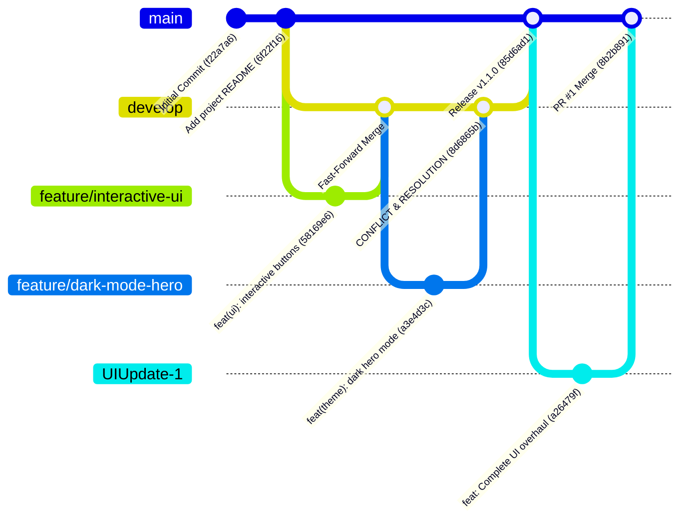

# DevOps Lab 1: Travel India - Branching and Git Flow Management

A comprehensive, production-grade DevOps exploration demonstrating collaborative Git branching strategies, merge conflict simulation and resolution, Pull Request workflows, and modern web application development.

---

## Team Members

- **Rehan** 
- **Sharon Matthew** 
- **Dinu Devees George** 

---

## Project Description

**Travel India** is a modern, responsive web application showcasing premier travel destinations across India (such as the Taj Mahal, Kerala Backwaters, Jaipur Pink City, and Goa Beaches).

Beyond serving as an interactive tourism portal featuring multi-page navigation (Home, Places, Gallery, Contact), dark mode theming, and destination filtering, this repository acts as a real-world case study and laboratory for **DevOps source code management (SCM)** best practices. It rigorously demonstrates:
- Isolated feature development and release branch lifecycle.
- 3-way conflict induction between concurrent feature branches.
- Manual conflict resolution and code harmonization.
- PR template standardization, code review, and branch merging.

---

## Technologies Used

- **Frontend and UI**: HTML5 (Semantic), CSS3 (Custom Design System, CSS Variables, Glassmorphism, Responsive Grid/Flexbox), Vanilla JavaScript (ES6+)
- **Version Control and DevOps**: Git, GitHub, Git Flow / GitHub Flow hybrid branching strategy
- **Development and Web Server**: Python 3 (`http.server`) / VS Code Live Server / Static Web Hosting
- **Documentation and CI/CD Tooling**: Markdown, Mermaid diagrams, GitHub PR Templates

---

## Git Branching Strategy

The team implemented a **Git Flow / GitHub Flow hybrid strategy** designed to support parallel engineering while protecting production stability:



### Branch Roles and Policies
1. **`main`**: Production-ready branch. Only clean, tested, and tagged releases are merged here. Direct pushes to `main` are restricted.
2. **`develop`**: Integration and staging branch where completed feature branches converge.
3. **`feature/interactive-ui`**: Short-lived feature branch implementing call-to-action buttons and quick package navigation.
4. **`feature/dark-mode-hero`**: Feature branch introducing dark hero themes and theme toggle logic.
5. **`UIUpdate-1`**: Multi-page complete UI overhaul including Places, Gallery, and Contact pages.

---

## Pull Requests Created

| PR # | Title | Source Branch | Target Branch | Merged By | Description & Scope |
| :--- | :--- | :--- | :--- | :--- | :--- |
| **#1** | Complete UI overhaul built on top of main branch | `UIUpdate-1` | `main` | Dinu Devees George | Enhanced UI design system, added Places, Gallery, and Contact pages with interactive filters and dark theme support. |
| **Lab Feature 1** | Interactive Hero UI & Action Buttons | `feature/interactive-ui` | `develop` | Sharon Matthew | Fast-forward merge introducing `.hero-actions`, `.btn-primary`, and `.btn-secondary`. |
| **Lab Feature 2** | Dark Mode Hero & Theme Toggle | `feature/dark-mode-hero` | `develop` | Sharon Matthew | 3-way merge requiring local conflict resolution in `index.html` and `style.css`. |
| **Release v1.1.0** | Release v1.1.0 Feature Integration | `develop` | `main` | Sharon Matthew | Production release `--no-ff` merge tag `v1.1.0`. |

---

## Merge Conflict

### What Caused the Conflict?
A merge conflict occurred during the integration of `feature/dark-mode-hero` into `develop` (which had already received changes from `feature/interactive-ui`).

Both feature branches branched from the common ancestor commit `6f22f16` and made **divergent modifications to the exact same lines of code**:
- **`index.html` (Lines 20-27)**:
  - `develop` (via `feature/interactive-ui`) added `.hero-actions` with *Explore Featured Tours* and *View Packages* buttons.
  - `feature/dark-mode-hero` altered the hero heading and added the *Toggle Dark Mode* button.
- **`css/style.css`**:
  - `develop` added custom styling for `.btn-primary` and `.btn-secondary`.
  - `feature/dark-mode-hero` updated base `button` properties and introduced dark hero background rules.

When running `git merge feature/dark-mode-hero`, Git halted with:
```text
CONFLICT (content): Merge conflict in travel-india/travel-india/css/style.css
CONFLICT (content): Merge conflict in travel-india/travel-india/index.html
Automatic merge failed; fix conflicts and then commit the result.
```

---

### How Was It Resolved?
Rather than picking one developer's version and discarding the other, a **harmonized resolution strategy** was adopted locally:

#### 1. Harmonizing `index.html`
Git conflict markers (`<<<<<<< HEAD`, `=======`, `>>>>>>>`) were inspected and cleaned. Both features were combined inside the hero action container:

```html
<section class="hero" id="hero-section">
    <h2>Discover Incredible India</h2>
    <p>Experience culture, heritage, vibrant traditions and breathtaking nature — by day and night.</p>

    <div class="hero-actions">
        <button class="btn-primary" onclick="showMessage()">Explore Featured Tours</button>
        <button class="btn-secondary" onclick="alert('Viewing popular packages!')">View Packages</button>
        <button class="theme-toggle-btn" onclick="toggleTheme()">Toggle Theme</button>
    </div>
</section>
```

#### 2. Harmonizing `css/style.css`
- Standardized the base `.hero` padding and transitions.
- Integrated the `.hero-actions` flexbox layout.
- Scoped dark mode styles cleanly under `body.dark-theme` so the theme toggle functions seamlessly across the entire page.

#### 3. Staging and Committing
```powershell
git add travel-india/travel-india/index.html travel-india/travel-india/css/style.css
git commit -m "Merge branch 'feature/dark-mode-hero' into develop (resolving conflicts in index.html and style.css)"
```

---

## Git Logs (Sanitized and Secure Audit Trail)

Below is the complete, sanitized repository commit history and topology (free of any sensitive credentials, tokens, or private emails):

### Visual Commit Graph
```text
*   8b2b891 (HEAD -> main, origin/main) Merge pull request #1 from Rehan038/UIUpdate-1
|\  
| * a26479f feat(UIUpdate-1): Complete UI overhaul built on top of main branch
|/  
* 7712088 docs: add lab branching guide and PR template
*   85d6ad1 Release v1.1.0: Integrated interactive UI and dark theme features
|\  
| *   8d6865b Merge branch 'feature/dark-mode-hero' into develop (resolving conflicts in index.html and style.css)
| |\  
| | * a3e4d3c feat(theme): add night/day dark hero mode and theme toggle
| |/  
|/|   
| * 58169e6 feat(ui): add interactive hero action buttons and quick navigation
|/  
* 6f22f16 Add project README
* f22a7a6 Initial Commit
```

---

## How to Run the Application

The web application is pure HTML, CSS, and JavaScript. No build tools or package installations are required.

### Local HTTP Server
Using Python:
```bash
# Navigate to the web application directory
cd travel-india/travel-india

# Start static HTTP server
python -m http.server 8000
```
Open your browser and navigate to:
```
http://localhost:8000
```

Using Node.js (`npx serve` or `http-server`):
```bash
cd travel-india/travel-india
npx serve .
```
